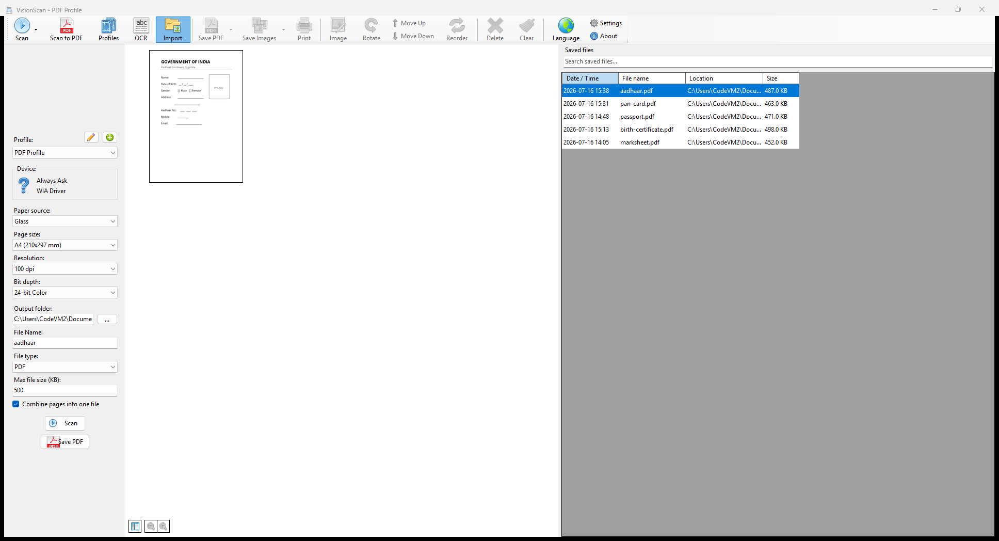
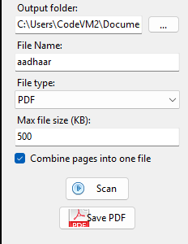
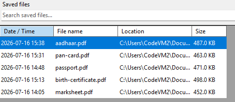
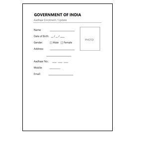
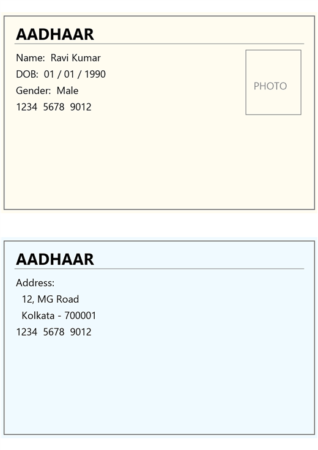

# VisionScan

**VisionScan by [Vision Technologies and Robotics](https://www.visiontech.com.in)** — a simple Windows app to scan your papers and save them as a **PDF** (or image), in one click.

➡️ **[Download the latest version](https://github.com/visiontech-com-ai/VisionScan-releases/releases/latest)** — get the `.zip`, unzip it anywhere, and run `VisionScan.exe`. No install needed.

The app also updates itself from this page.

---

## What the screen looks like

Three parts to know:

1. **Left side** — your scan settings and the **Scan** / **Save PDF** buttons.
2. **Middle** — the **preview** of the page you scanned or opened.
3. **Right side** — the list of **files you have saved**.

---

## 1. Scan to a size limit (size-driven scan)

Some websites only accept small files (like "under 500 KB"). VisionScan can do this for you.

**How:**

1. In the **File Name** box, type a name (example: `aadhaar`).
2. In **File type**, choose **PDF**.
3. In **Max file size (KB)**, type a number. `500` means about 500 KB.
4. Click **Scan**, then **Save PDF**.

VisionScan makes the file fit under the size you asked for. It first lowers the quality a little; if it is still too big, it makes the picture smaller. **Leave the box empty if you do not want any limit.**

 

---

## 2. The saved files list (file grid)

Every file you save shows up on the **right side**, newest on top. For each file you see:

- **Date / Time** — when you saved it
- **File name**
- **Location** — the folder it is in
- **Size**

Type in the **Search saved files…** box to find one quickly. This list stays even after you close and open the app again.

> 💡 If a file with the same name already exists, VisionScan adds the time to the new name. **Your old files are never deleted or replaced.**

---

## 3. The preview panel

The **middle** of the window shows what you scanned or opened, so you can check it **before** you save.

- Click **Scan** to bring a page from your scanner into the preview.
- Or click **Import** to open a picture or PDF you already have.
- After you save, the preview keeps showing your last file. The next time you scan, it starts fresh.
- Tick **Combine pages into one file** to put many pages into **one** PDF.

 

---

## 4. Two sides on one page (ID cards)

Scan both sides of a card — Aadhaar, PAN, voter ID (EPIC), driving licence — and put them **on one page**, like a photocopy.

**How:**

1. **Scan** (or **Import**) side 1, then side 2 — now you have two pages.
2. Type a **File Name** and pick the **File type** and, if you want, a **Max file size (KB)**.
3. Click **Combine to page**. A small window shows both sides on one sheet — you can flip the layout or swap top/bottom, then click **OK**.
4. VisionScan saves one file with both sides.

The combined page uses the **Page size** you picked on the left (A4, Letter, …) and is squeezed under your **Max file size** too. Tick **Keep original pages** in the window if you also want to keep the two single scans.

 

---

## Quick start (the whole thing)

1. Type a **File Name** (example: `birth-certificate`).
2. Choose **File type** = **PDF**.
3. *(Optional)* Set **Max file size (KB)**, example `500`.
4. Put your paper in the scanner and click **Scan**. *(Or click **Import** to open a file you already have.)*
5. Click **Save PDF**.

Your file is saved to the **Output folder** and appears in the **Saved files** list on the right.

> ⌨️ **Tip:** Press **Enter** in the File Name box to start scanning right away.

---

## Keeping VisionScan up to date

VisionScan can update itself from this page — you do not need to reinstall.

1. Click **About** (top-right corner).
2. Tick **Check for updates**.
3. If a newer version is out, an **Install …** link appears. Click it — the new version downloads and installs by itself, then VisionScan restarts.

You can also download the newest `.zip` from the **[Releases page](https://github.com/visiontech-com-ai/VisionScan-releases/releases/latest)** at any time.

---
---

# ভিশনস্ক্যান (VisionScan)

**ভিশনস্ক্যান — [Vision Technologies and Robotics](https://www.visiontech.com.in) থেকে।** এটি একটি সহজ Windows অ্যাপ, যা দিয়ে আপনি আপনার কাগজ স্ক্যান করে **PDF** (বা ছবি) হিসেবে সেভ করতে পারেন — মাত্র এক ক্লিকে।

➡️ **[সর্বশেষ ভার্সন ডাউনলোড করুন](https://github.com/visiontech-com-ai/VisionScan-releases/releases/latest)** — `.zip` ফাইলটি নামিয়ে যেকোনো জায়গায় আনজিপ করুন এবং `VisionScan.exe` চালান। ইনস্টল করার দরকার নেই।

অ্যাপটি নিজে থেকেই এই পেজ থেকে আপডেট নিয়ে নেয়।

---

## স্ক্রিনটি দেখতে কেমন

তিনটি অংশ চিনে রাখুন:

1. **বাঁ দিক** — স্ক্যানের সেটিং এবং **Scan** / **Save PDF** বোতাম।
2. **মাঝখান** — আপনি যে পেজ স্ক্যান বা ওপেন করেছেন তার **প্রিভিউ**।
3. **ডান দিক** — আপনি যেসব ফাইল **সেভ করেছেন** তার তালিকা।

---

## ১. নির্দিষ্ট সাইজে স্ক্যান (size-driven scan)

অনেক ওয়েবসাইট শুধু ছোট ফাইল নেয় (যেমন "৫০০ KB-এর কম")। ভিশনস্ক্যান এটি আপনার হয়ে করে দিতে পারে।

**যেভাবে করবেন:**

1. **File Name** ঘরে একটি নাম লিখুন (যেমন: `aadhaar`)।
2. **File type**-এ **PDF** বেছে নিন।
3. **Max file size (KB)** ঘরে একটি সংখ্যা লিখুন। `500` মানে প্রায় ৫০০ KB।
4. **Scan** চাপুন, তারপর **Save PDF** চাপুন।

ভিশনস্ক্যান ফাইলটিকে আপনার বলা সাইজের নিচে নামিয়ে আনে। প্রথমে সামান্য কোয়ালিটি কমায়; তাতেও বড় থাকলে ছবিটিকে ছোট করে। **কোনো সীমা না চাইলে ঘরটি খালি রাখুন।**

 

---

## ২. সেভ করা ফাইলের তালিকা (file grid)

আপনি যে ফাইলই সেভ করেন সেটি **ডান দিকে** দেখা যায়, নতুনটি সবার উপরে। প্রতিটি ফাইলের জন্য দেখবেন:

- **Date / Time** — কখন সেভ করেছেন
- **File name** — ফাইলের নাম
- **Location** — কোন ফোল্ডারে আছে
- **Size** — ফাইলের সাইজ

**Search saved files…** ঘরে লিখে দ্রুত খুঁজে নিতে পারেন। অ্যাপ বন্ধ করে আবার খুললেও এই তালিকা থেকে যায়।

> 💡 একই নামের ফাইল আগে থেকে থাকলে ভিশনস্ক্যান নতুন নামের সাথে সময় জুড়ে দেয়। **আপনার পুরনো ফাইল কখনো মুছে যায় না বা বদলে যায় না।**

---

## ৩. প্রিভিউ প্যানেল

উইন্ডোর **মাঝখানে** আপনি যা স্ক্যান বা ওপেন করেছেন তা দেখা যায়, যাতে সেভ করার **আগেই** যাচাই করে নিতে পারেন।

- স্ক্যানার থেকে পেজ আনতে **Scan** চাপুন।
- অথবা আগে থেকে থাকা ছবি বা PDF খুলতে **Import** চাপুন।
- সেভ করার পর প্রিভিউতে আপনার শেষ ফাইলটি দেখাতে থাকে। পরেরবার স্ক্যান করলে নতুন করে শুরু হয়।
- অনেক পেজ **এক** PDF-এ রাখতে **Combine pages into one file** টিক দিন।

 

---

## ৪. এক পেজে দুই দিক (আইডি কার্ড)

কার্ডের দুই দিক — আধার, প্যান, ভোটার আইডি (EPIC), ড্রাইভিং লাইসেন্স — স্ক্যান করে **এক পেজে** বসান, ফটোকপির মতো।

**যেভাবে করবেন:**

1. আগে **Scan** (বা **Import**) দিয়ে ১ম দিক, তারপর ২য় দিক আনুন — এখন দুটি পেজ হলো।
2. একটি **File Name** লিখুন, **File type** বেছে নিন, চাইলে **Max file size (KB)** দিন।
3. **Combine to page** চাপুন। একটি ছোট উইন্ডোতে দুই দিক এক পেজে দেখাবে — চাইলে সাজানো বদলান বা উপর-নিচ অদল-বদল করুন, তারপর **OK** চাপুন।
4. ভিশনস্ক্যান দুই দিক সহ একটি ফাইল সেভ করে।

কম্বাইন করা পেজটি বাঁ দিকে বেছে নেওয়া **Page size** (A4, Letter …) অনুযায়ী হয় এবং আপনার **Max file size**-এর নিচেও নামিয়ে আনা হয়। দুটি আলাদা স্ক্যানও রাখতে চাইলে উইন্ডোতে **Keep original pages** টিক দিন।

 

---

## দ্রুত শুরু (পুরো কাজটি)

1. একটি **File Name** লিখুন (যেমন: `birth-certificate`)।
2. **File type** = **PDF** বেছে নিন।
3. *(ইচ্ছা করলে)* **Max file size (KB)** দিন, যেমন `500`।
4. স্ক্যানারে কাগজ রেখে **Scan** চাপুন। *(অথবা আগে থেকে থাকা ফাইল খুলতে **Import** চাপুন।)*
5. **Save PDF** চাপুন।

আপনার ফাইল **Output folder**-এ সেভ হয় এবং ডান দিকের **Saved files** তালিকায় দেখা যায়।

> ⌨️ **টিপ:** File Name ঘরে **Enter** চাপলেই সাথে সাথে স্ক্যান শুরু হয়।

---

## ভিশনস্ক্যান আপডেট রাখা

ভিশনস্ক্যান এই পেজ থেকে নিজে আপডেট নিতে পারে — আবার নতুন করে ইনস্টল করতে হয় না।

1. উপরে ডান দিকে **About** ক্লিক করুন।
2. **Check for updates** টিক দিন।
3. নতুন ভার্সন থাকলে একটি **Install …** লিঙ্ক আসে। ক্লিক করলেই নতুন ভার্সন নিজে নেমে ইনস্টল হয়ে যায়, তারপর ভিশনস্ক্যান আবার চালু হয়।

চাইলে যেকোনো সময় **[Releases পেজ](https://github.com/visiontech-com-ai/VisionScan-releases/releases/latest)** থেকে নতুন `.zip` ডাউনলোড করতে পারেন।

---

Public download host for VisionScan Windows builds. Used by the app auto-updater. Source: private repo `visiontech-com-ai/VisionScan`.
